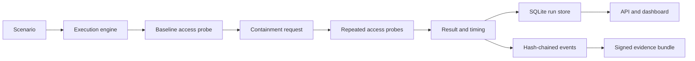

# Architecture

## Execution Flow

ContainmentCI evaluates outcomes, not API acknowledgements. A target passes only after a
credential or session that worked during the baseline phase is denied during the
post-containment phase.

## Trust Boundaries

- Scenario files are trusted configuration and may select explicit target endpoints.
- Provider credentials are supplied through environment variables or future secret-manager
  integrations.
- Provider APIs and target systems are external failure boundaries.
- Evidence signatures prove bundle integrity relative to the configured signing key.
- The current HMAC signer is intended for a single administrative domain. A production
  deployment should use asymmetric KMS signing.

## Provider Contract

Each provider implements two operations:

- `verify_access`: use the synthetic credential or session to access the target resource.
- `contain`: request revocation, disablement, quarantine, or another containment control.

Providers must not treat successful containment API responses as successful checks.

## Scaling Path

- Replace local SQLite with PostgreSQL.
- Run executions in a worker queue.
- Store encrypted credential handles in a secret manager.
- Sign evidence through AWS KMS, Azure Key Vault, or GCP Cloud KMS.
- Deploy regional probe workers near protected systems.
- Add a scheduler and alert routing for containment-time SLO violations.

