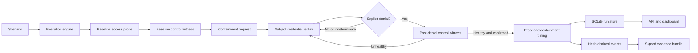

# Architecture

## Execution Flow

ContainmentCI evaluates outcomes, not API acknowledgements. A target passes only after a
credential or session that worked during the baseline phase is denied during the
post-containment phase. When a control witness is configured, that independent credential must
work before containment and during every counted denial. A separate endpoint is labeled as an
availability witness rather than a same-resource control.

## Controlled Proof Model

Access probes do not return a boolean. They classify the observation as:

- `ALLOWED`: the credential reached the protected resource.
- `DENIED`: the provider returned a recognized authorization denial.
- `INDETERMINATE`: the response could be throttling, an outage, a redirect, or another ambiguous
  condition.

Only consecutive `DENIED` subject samples can prove containment. A required control witness must
be `ALLOWED` at baseline and during every counted sample. This prevents an unavailable service
from looking like a successful kill switch.

The per-target containment clock starts immediately before the containment request. The result
passes only when the configured number of causal denial samples arrives within
`max_containment_seconds` (or the scenario timeout when no target override is set).
Each provider operation is also bounded by `provider_timeout_seconds`; post-containment calls are
bounded by whichever is smaller: that request timeout or the remaining containment SLO.

Simulation targets execute serially. A live scenario is limited to one state-changing target so
delayed effects from one control cannot be credited to another. Live runs also acquire an atomic
SQLite lease on the identity and resource, coordinating processes that share the same state
directory. Separate CI runners or hosts must use a fixture-specific platform concurrency group
or an external global lock. Do not reuse one identity for a different control until the fixture
has been restored and its access behavior is stable.

## Trust Boundaries

- Scenario files are trusted configuration and may select explicit target endpoints.
- Provider credentials are supplied through environment variables or future secret-manager
  integrations.
- Provider APIs and target systems are external failure boundaries.
- Evidence signatures and the event hash chain prove bundle integrity relative to the configured
  signing key.
- The current HMAC signer is intended for a single administrative domain. A production
  deployment should use asymmetric KMS signing.
- A healthy witness rules out broad target unavailability but cannot eliminate every confounder,
  such as independent credential expiry or a simultaneous outside administrative action. The
  result is strong controlled evidence, not an absolute causal attestation.

## Provider Contract

Each provider implements two required operations and one optional witness:

- `verify_access`: use the synthetic credential or session to access the target resource.
- `contain`: request revocation, disablement, quarantine, or another containment control.
- `verify_control_access`: verify an untouched credential against the same resource, or label a
  different endpoint as an availability witness.

Providers must not treat successful containment API responses as successful checks. They must
also classify throttling, transport failures, 5xx responses, and unknown response shapes as
`INDETERMINATE`, never `DENIED`.

The generic HTTP provider accepts configured `401` and endpoint-contract `403` denial statuses,
plus `404` when a distinct same-resource control proves the resource still exists. Scenario
authors must list only statuses their endpoint documents as unambiguous authorization decisions;
common throttling headers force `INDETERMINATE`. Subject credentials may not overlap with control
or containment credentials by environment reference or loaded value.

## Scaling Path

- Replace local SQLite with PostgreSQL.
- Run executions in a worker queue.
- Store encrypted credential handles in a secret manager.
- Sign evidence through AWS KMS, Azure Key Vault, or GCP Cloud KMS.
- Deploy regional probe workers near protected systems.
- Add a scheduler and alert routing for containment-time SLO violations.

